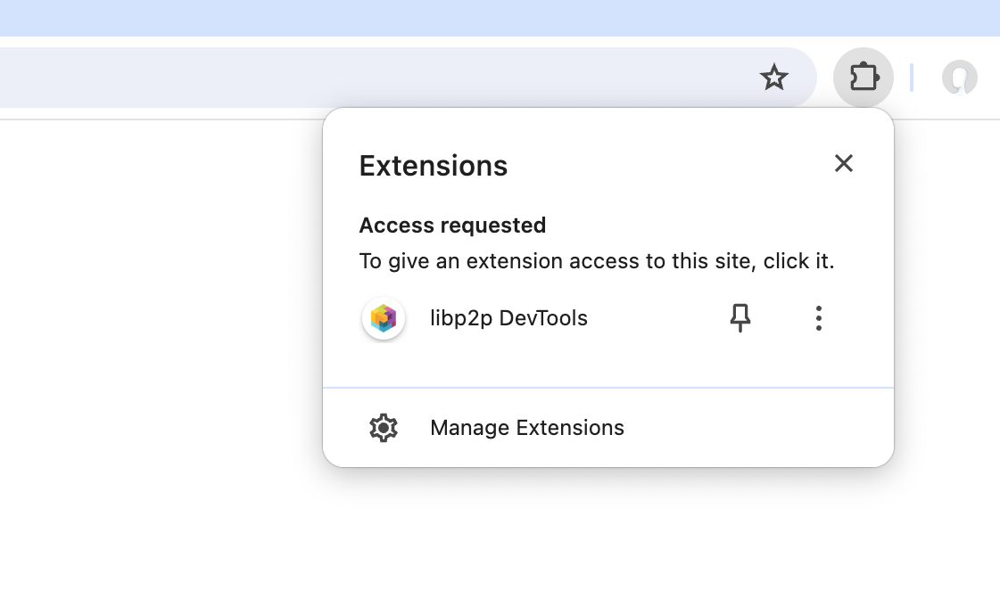
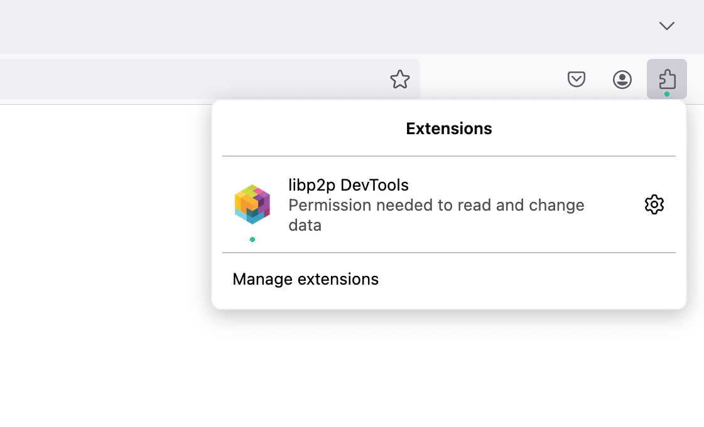

# js-libp2p DevTools

> Browser DevTools plugin to inspect a libp2p node running on the current page

A [DevTools](https://developer.chrome.com/docs/devtools) plugin that adds a "libp2p" tab to your developer tools that contacts a libp2p node running on the current page.

Works with [@ipshipyard/libp2p-inspector-metrics](https://www.npmjs.com/package/@ipshipyard/libp2p-inspector-metrics) which supplies metrics and allows us to interact with the running node.


## Installation instructions

### 1. Browser installation

Until this plugin is published on the relevant browser plugin stores, please run this locally.

1. Clone this repo
2. Run `npm i && npm run build`
3. Install as an unpacked/temporary add on for your browser:
    - Chrome: [How to load an unpacked extension](https://knowledge.workspace.google.com/kb/load-unpacked-extensions-000005962)
    - Firefox: [How to install temporary add-ons](https://developer.mozilla.org/en-US/docs/Mozilla/Add-ons/WebExtensions/Your_first_WebExtension#installing)

### 2. App installation

Configure `@ipshipyard/libp2p-inspector-metrics` as your metrics implementation:

```ts
import { createLibp2p } from 'libp2p'
import { inspectorMetrics } from '@ipshipyard/libp2p-inspector-metrics'

const node = await createLibp2p({
  metrics: inspectorMetrics(),
  //... other options here
})
```

### 3. Permissions

With the move to Manifest v3, users must now [opt in](https://blog.mozilla.org/addons/2022/11/17/unified-extensions-button-and-how-to-handle-permissions-in-manifest-v3/) to running content scripts on a page.

#### Chrome

Please click the extensions button, then grant the extension permission to run:



#### Firefox

Please click the extensions button, then grant the extension permission to run:



### 4. Go!

Browse to your webapp and open the DevTools, you should see a "libp2p" tab towards the right hand side of the toolbar. Click it to see stats about the running node.

## What's next?

1. Tests
  - There aren't a lot of tests here yet
2. Better UI
  - It's quite rough
3. Graphs
  - We don't do much with the collected metrics yet. It would be nice to use Chart.js or similar to show some useful graphs
  - Bonus points for letting the user define their own graphs a la Grafana/Prometheus
  - More bonus points for being able to export/import graph configs
4. Dynamic panels
  - We should be able to inspect the libp2p node's configured services (or protocols?) and, for example, only show a DHT tab if the DHT is configured
5. Light theme support
  - There are partial overrides for light theme font/background/border colours but we need better detection of when it's enabled
6. ??? more features here
